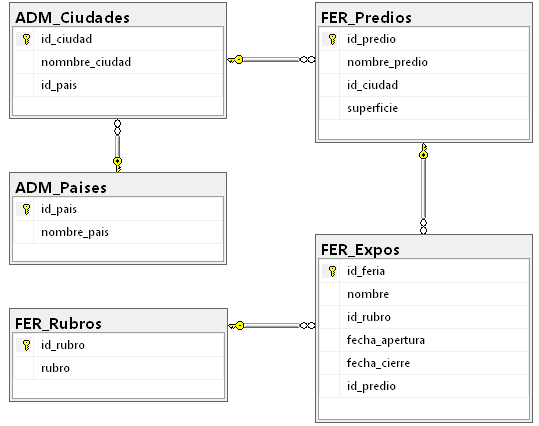

# Practica 2 - Eventos

## Consigna

El esquema responde a una empresa organizadora de eventos y se debe optimizar la gestión de consultas sobre el motor de bases de datos mediante la implementación de vistas.

## Datos de apoyo

Los datos necesarios se encuentran en el anexo.

## Entrega

Presentar en forma individual el código SQL para resolver los ítems solicitados.

Además, incluir:

- Relaciones en el diagrama generado por SQL.
- Diccionario de datos.

## Ítems a resolver

1. Crear la base de datos `eventos_apellido`.
2. Crear tablas, claves, relaciones y restricciones según el DER.
3. Cargar los datos indicados en el anexo.
4. Crear la vista `VW_Predios` que devuelva todos los predios que comienzan con la letra `L`, mostrando:
   - `nombre_predio`
   - `nombre_ciudad`
   - `nombre_pais`
5. Crear la vista `VW_Feriashoy` que devuelva todas las ferias de Ferias/Exposiciones que tengan lugar entre `01/01/2024` y hoy, mostrando:
   - `nombre_feria`
   - `rubro`
   - `fecha_apertura`
   - `fecha_cierre`
6. Crear la vista `VW_Predios2` con las columnas:
   - `nombre_predio`
   - `id_ciudad`
   - `superficie`

   Utilizar esta vista para insertar un nuevo predio. Tener en cuenta que, al no poder ingresar `id_predio`, este debe ser autonumérico para incrementarse correctamente.

## Resolucion de la Practica

### Relaciones en el Diagrama

### Diccionario de Datos

| Tabla            | Atributo       | Tipo de Dato  | Descripción                                   |
| :--------------- | :------------- | :------------ | :-------------------------------------------- |
| **ADM_Paises**   | id_pais        | INT (PK)      | Identificador único del país.                 |
| **ADM_Paises**   | nombre_pais    | NVARCHAR(100) | Nombre del país.                              |
| **ADM_Ciudades** | id_ciudad      | INT (PK)      | Identificador único de la ciudad.             |
| **ADM_Ciudades** | nomnbre_ciudad | NVARCHAR(100) | Nombre de la ciudad.                          |
| **ADM_Ciudades** | id_pais        | INT (FK)      | Relación con la tabla de países.              |
| **FER_Rubros**   | id_rubro       | INT (PK)      | Identificador único del rubro.                |
| **FER_Rubros**   | rubro          | NVARCHAR(100) | Descripción del rubro (ej: Casamientos).      |
| **FER_Predios**  | id_predio      | INT (PK/AI)   | Identificador autonumérico del predio.        |
| **FER_Predios**  | nombre_predio  | NVARCHAR(100) | Nombre del lugar.                             |
| **FER_Predios**  | id_ciudad      | INT (FK)      | Ciudad donde se ubica el predio.              |
| **FER_Predios**  | superficie     | NUMERIC(9)    | Tamaño en metros cuadrados.                   |
| **FER_Expos**    | id_feria       | INT (PK)      | Identificador único de la feria o exposición. |
| **FER_Expos**    | nombre         | NVARCHAR(100) | Nombre del evento.                            |
| **FER_Expos**    | id_rubro       | INT (FK)      | Relación con el rubro del evento.             |
| **FER_Expos**    | fecha_apertura | DATETIME      | Fecha y hora de inicio del evento.            |
| **FER_Expos**    | fecha_cierre   | DATETIME      | Fecha y hora de finalización.                 |
| **FER_Expos**    | id_predio      | INT (FK)      | Predio donde se realiza la expo.              |

### Vistas

4. VW_Predios
Vista que devuelve los predios cuyo nombre comienza con la letra "L".

| nombre_predio | nombre_ciudad | nombre_pais |
| :------------ | :------------ | :---------- |
| La Posta      | Rosario       | Argentina   |
| La Noche      | Rosario       | Argentina   |
| La Estrella   | Cordoba       | Argentina   |

5. VW_Feriashoy
Vista que muestra ferias/exposiciones con fecha entre `01/01/2024` y hoy.

| nombre_feria                                  | rubro | fecha_apertura | fecha_cierre |
| :-------------------------------------------- | :---- | :------------- | :----------- |

(Sin resultados en el rango de fechas actual)

6. VW_Predios2 (con insert)
Vista con `nombre_predio`, `id_ciudad` y `superficie`.

| nombre_predio     | id_ciudad | superficie |
| :---------------- | :-------: | :--------: |
| La Posta          |     1     |    1200    |
| El Quincho        |     1     |    1000    |
| Francia           |     3     |    4000    |
| El Palomar        |     4     |    2500    |
| La Noche          |     1     |    200     |
| La Estrella       |     2     |    5000    |
| El Establo        |     6     |    600     |
| Nuevo Predio Test |     1     |    1500    |
